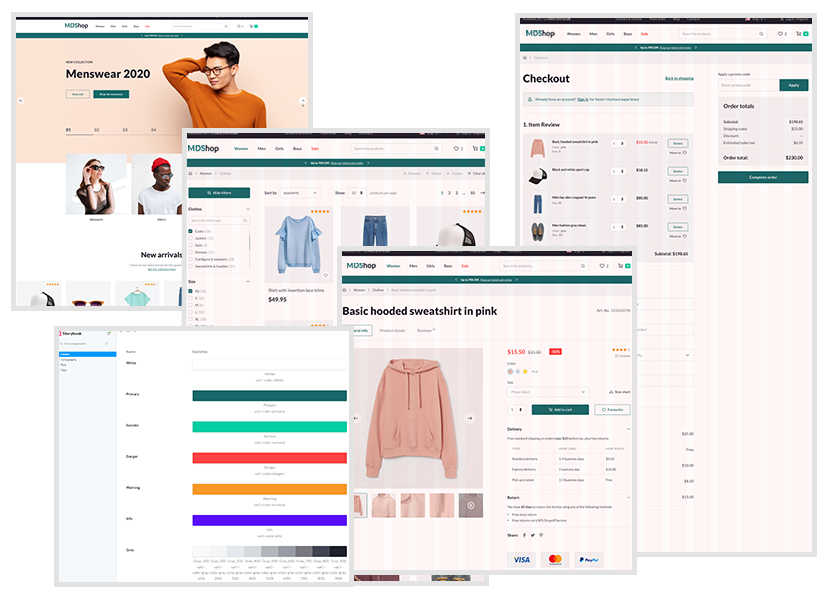

<h1 align="center">🎉 MDShop 🎉</h1>

<p align="center">  
  
  <a href="https://github.com/ofnullable/react-spa-template/issues">
    
  </a>
</p>

## Online store React SPA

Templates included: home page, product catalog, product card, checkout page, text page.

There is functionality for advanced card filtering, sorting, searching, selecting various product packaging options, setting up discounts and promotional codes, selecting delivery and payment options.



## Live demo

Website: [https://mdshop.solutions4web.ru/](https://mdshop.solutions4web.ru/)

Storybook: [https://mdshop-story.solutions4web.ru/](https://mdshop-story.solutions4web.ru/)

## Main Libraries

- Vite
- React 
- React Redux
- React Query
- @reduxjs/toolkit
- Storybook
- Typescript
- Jest
- Sass
- ESlint
- Stylelint
- Prettier
- CI GitHub Actions config

## Installation

```shell
# clone this repository
$ git clone https://github.com/leopard-work/MDShop

# go into template directory
$ cd MDShop

# install dependencies
$ npm install
```

### Run dev server

```shell
$ npm run dev
```

Storybook on [http://localhost:5173](http://localhost:5173)

### Run storybook

```shell
$ npm run sb
```

Run dev server on [http://localhost:6006](http://localhost:6006)

### Build

```shell
$ npm run build
```

### Linting

```shell
$ npm run test

$ npm run lint

$ npm run stylelint

$ npm run prettier
```